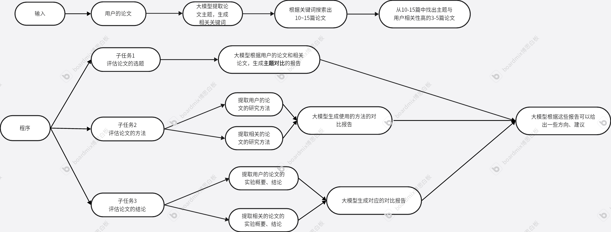
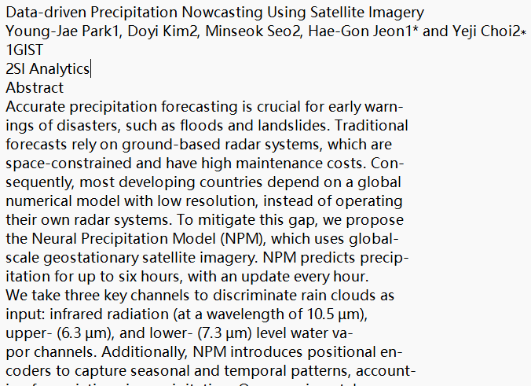
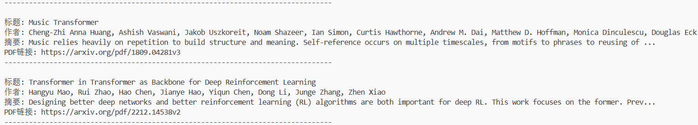

# 基于大模型的学术论文辅助评审系统

## 一、核心解决的具体问题

### 问题描述
写论文时，容易难以跳出自己的思维框架，无法全面评估论文在**选题创新性、方法论严谨性和实验充分性**上的不足。

### 解决方案
使用该系统可根据用户输入的论文，找出相似的其他论文，并列出用户的论文在**选题创新性、方法论严谨性和实验充分性**这些方面，与其他相似论文的相似性或差异性，为用户给出修改提示，帮助用户进一步修改或撰写论文。

## 二、具体方法

### 1. 论文输入和预处理

#### 输入方式
- 用户上传的论文PDF（或arXiv链接）

#### 预处理流程
- 程序找出与用户相关的论文

### 2. 分子任务进行

#### 子任务1：创新性评估
- 定位本文的核心主张，搜索并对比已有工作的主要观点。

#### 子任务2：方法对比
- 提取本文的研究方法，查找领域内主流及前沿方法。

#### 子任务3：实验验证
- 提取本文的实验数据和结论，寻找采用类似方法或达到类似效果的其他研究进行对比。

## 三、技术验证

### 1. 论文pdf文件的处理
- 使用Python的PyMuPDF库，可将论文的可复制文字提取出来

### 2. 大模型的接口调用
- 使用Deepseek提供的api，可进行大模型的调用

### 3. 论文的搜索
- 使用arxiv论文网站提供的接口，可根据标题、作者、摘要进行论文的搜索

### 4. 论文的相关性判断
- 使用语义模型，可计算出两篇论文的相关性
- 
 
## 四、扩展
- 以上的流程是线性的，可以加入循环优化
  -若相关论文<3篇，自动用LLM生成新搜索词进行二次检索
- 在每个子任务分析后增加：
  - 置信度评估：LLM输出分析结果时，同时输出置信度评分。若置信度低（如<70%），则标记“此部分分析可靠性较低，建议人工复核”。
- 论文输入
  - 增加格式检查：检测PDF是否可复制？若否，触发OCR流程（可用Tesseract）。
  - 智能分块：用LLM识别PDF中的“摘要/方法/实验”章节，而非全文处理，提高后续分析精度。
- 三个子任务的具体化
  - 子任务1创新性评估：
    输出格式模板化：“本文创新点：... | 相似工作：... | 差异化程度：高/中/低”
  - 子任务2方法对比：
    增加方法分类标签（如“监督学习/无监督学习”、“CNN/Transformer”），便于快速定位差异。
  - 子任务3实验验证：
    重点对比相同数据集上的性能指标，若数据集不同则明确标注“不可直接比较”。
- 增加失败处理
  - 网络异常重试机制。
  - LLM输出格式错误时的正则表达式兜底。
## 五、亮点
- 深度对比：在创新点、方法、实验三个维度进行结构化对比，而不只是摘要相似。
- 智能迭代：系统会评估分析质量，自动调整检索策略。
- 可解释输出：不仅给评分，还给出具体修改建议和证据来源。
