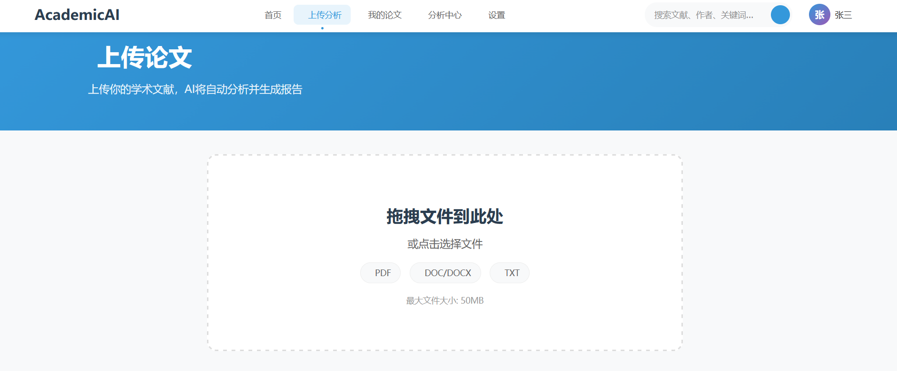

# 2月8日周报

# 系统设计
## 流程
提前下载多篇论文，人工输入多篇论文的pdf，系统对论文进行归纳总结，对总结展示

### 1.上传论文
### 2.提取论文的文字
若论文为pdf文件，使用Python的PyMuPDF库，可将论文的可复制文字提取出来，若该库无法提取，可使用ocr识别
### 3.调用大模型ai对每篇论文进行总结
### 4.对总结进行展示

# 前端设计
## 首页设计

## 论文上传
使用拖拽形式上传论文或者选择上传

上传完成后，下边显示ai可一键生成的选项，可选择需要的选项

## 我的论文
上传过的论文可在这个页面显示，可以选择要查看的论文，查看ai生成的内容。可对上传的论文增删改查
## 分析中心
一键生成文献综述
一键统计选择的论文的词频排行
