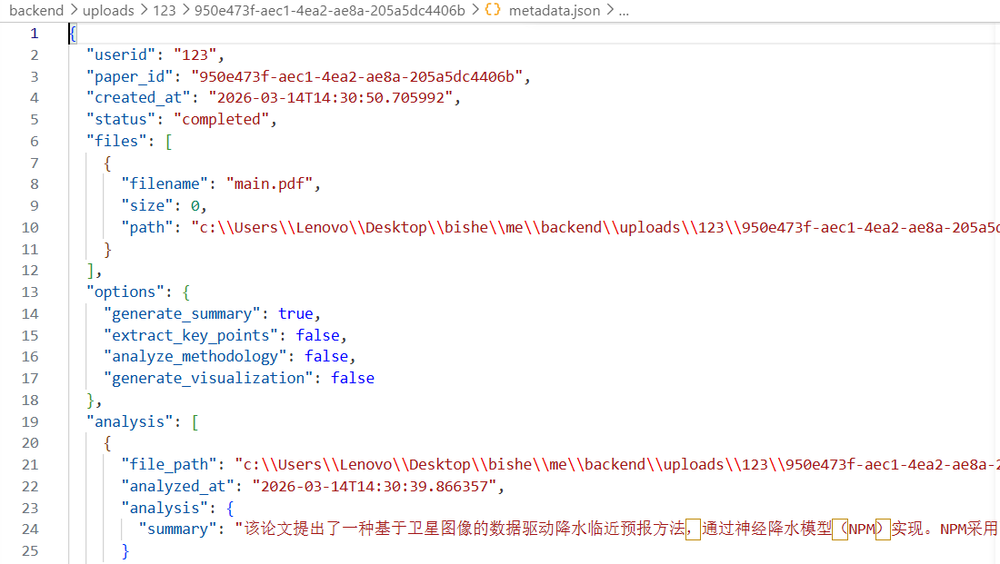

# 毕业设计周报

项目阶段：后端服务深度开发与AI集成

---

## 一、本周工作总结

本周对后端文件上传与分析服务进行了功能扩展，实现了多用户支持、后台异步分析任务、实时进度推送以及与DeepSeek大模型的AI分析功能集成

## 二、具体工作内容

### 1. 用户体系与数据隔离重构

•   用户标识引入：在接口中增加userid参数，改造为按用户隔离模式。

•   目录结构重构：存储路径从uploads/{paper_id}/调整为uploads/{userid}/{paper_id}/，实现物理隔离。

•   元数据升级：在metadata.json中加入userid和status（任务状态）字段。

### 2. 异步任务与后台处理机制

•   解耦上传与分析：将同步分析重构为异步后台任务，通过BackgroundTasks函数实现，提升接口响应速度。

•   任务状态管理：定义状态流转：pending -> running -> completed/failed。

•   进度回调机制：在run_analysis_task中实现progress_callback，实时更新进度与消息。

### 3. 服务器推送事件（SSE）实现

•   实时进度推送接口：新增GET /api/paper/{userid}/{paper_id}/events接口，采用SSE协议。

•   实现原理：通过长连接监控元数据文件的修改时间，实现近实时进度推送。

### 4. 核心AI分析功能集成

•   独立分析模块：创建analyse.py模块，封装DeepSeek API交互逻辑。

•   文本提取功能：使用PyMuPDF库实现PDF文本提取。

•   结构化AI调用：analyze_paper_by_option函数构造Prompt，调用DeepSeek API并约束其返回JSON格式结果。

•   进度集成：分析函数支持progress_callback，反馈子步骤进度。

### 5. 路由与配置

•   路由参数更新：所有相关路由适配新的userid路径参数。

## 三、关键技术实现

1.  FastAPI BackgroundTasks：用于后台执行耗时分析任务。
2.  SSE (Server-Sent Events)：实现服务器到客户端的单向实时通信，适用于进度推送。
3.  DeepSeek API调用：通过openai库兼容接口调用deepseek-chat模型，约束JSON输出。
4.  基于文件系统的状态同步：通过读写metadata.json文件，实现后台进程与SSE推送进程间的状态同步。
